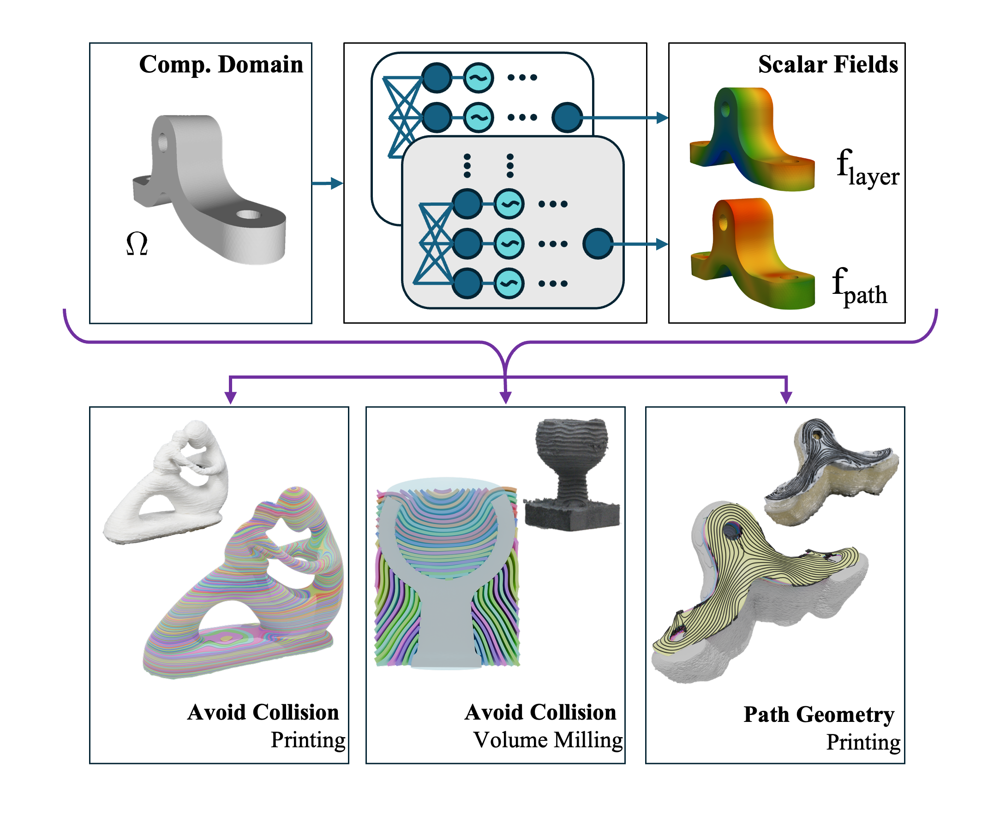

<!-- Google tag (gtag.js) -->

## Abstract
Existing curved-layer-based process planning methods for multi-axis manufacturing address collisions only indirectly and generate toolpaths in a post-processing step, leaving toolpath geometry uncontrolled during optimization. We present an implicit neural field-based framework for multi-axis process planning that overcomes these limitations by embedding both layer generation and toolpath design within a single differentiable pipeline. Using sinusoidally activated neural networks to represent layers and toolpaths as implicit fields, our method enables direct evaluation of field values and derivatives at any spatial point, thereby allowing explicit collision avoidance and joint optimization of manufacturing layers and toolpaths. We further investigate how network hyperparameters and objective definitions influence singularity behavior and topology transitions, offering built-in mechanisms for regularization and stability control. The proposed approach is demonstrated on examples in both additive and subtractive manufacturing, validating its generality and effectiveness.

Link to paper: [arXiv](https://arxiv.org/abs/2511.17578) | Journal (To be added when online)

## Video
<iframe width="100%" height="480" src="https://www.youtube.com/embed/9nTCbEfrANk" title="Planning for Multi-Axis Manufacturing: Direct Control over Collision Avoidance and Toolpath Geometry" frameborder="0" allow="accelerometer; autoplay; clipboard-write; encrypted-media; gyroscope; picture-in-picture; web-share" referrerpolicy="strict-origin-when-cross-origin" allowfullscreen></iframe>

## Code
Source code with selected examples can be found [here](https://github.com/neelotpal-d/Implicit_MultiAxis/tree/main). Meanwhile, if you have any questions, please drop us a mail: [neelotpal.dutta@manchester.ac.uk](mailto:neelotpal.dutta@manchester.ac.uk) or  [charlie.wang@manchester.ac.uk](mailto:charlie.wang@manchester.ac.uk).

## Cite As
<pre> Dutta, N., Zhang, T., Liu, T., Chen, Y. and Wang, C.C., 2025. Implicit Neural Field-Based Process Planning for Multi-Axis Manufacturing: Direct Control over Collision Avoidance and Toolpath Geometry., Computer-Aided Design, accepted, May 2026. </pre>
