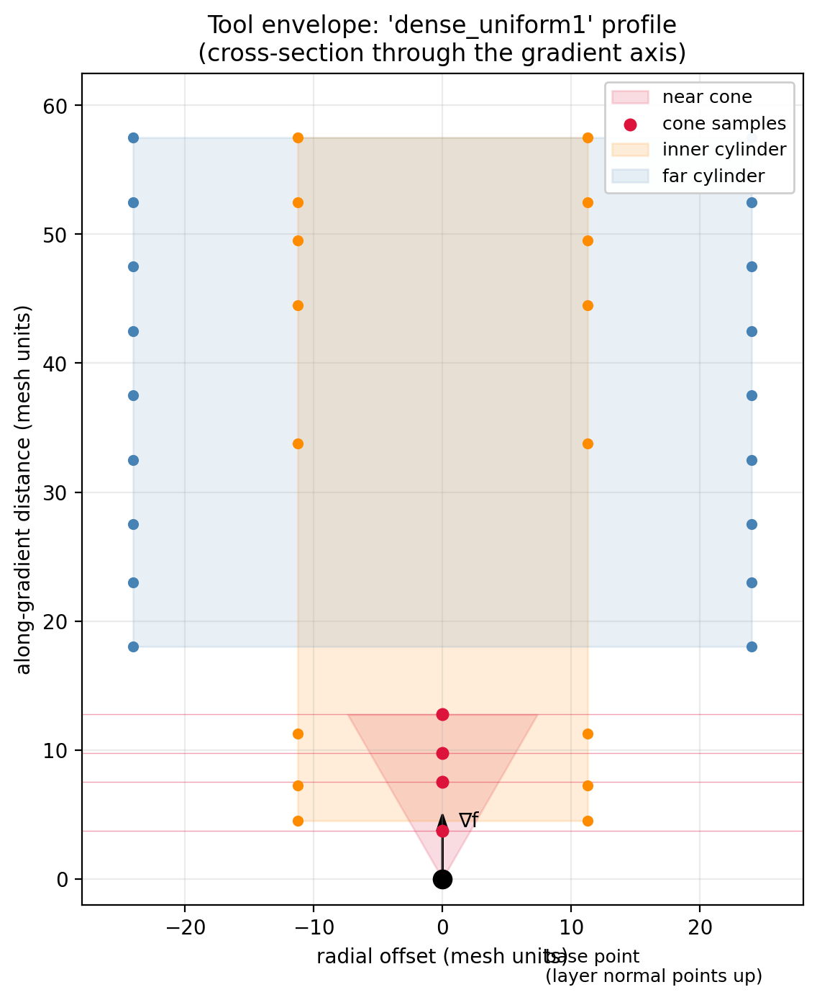
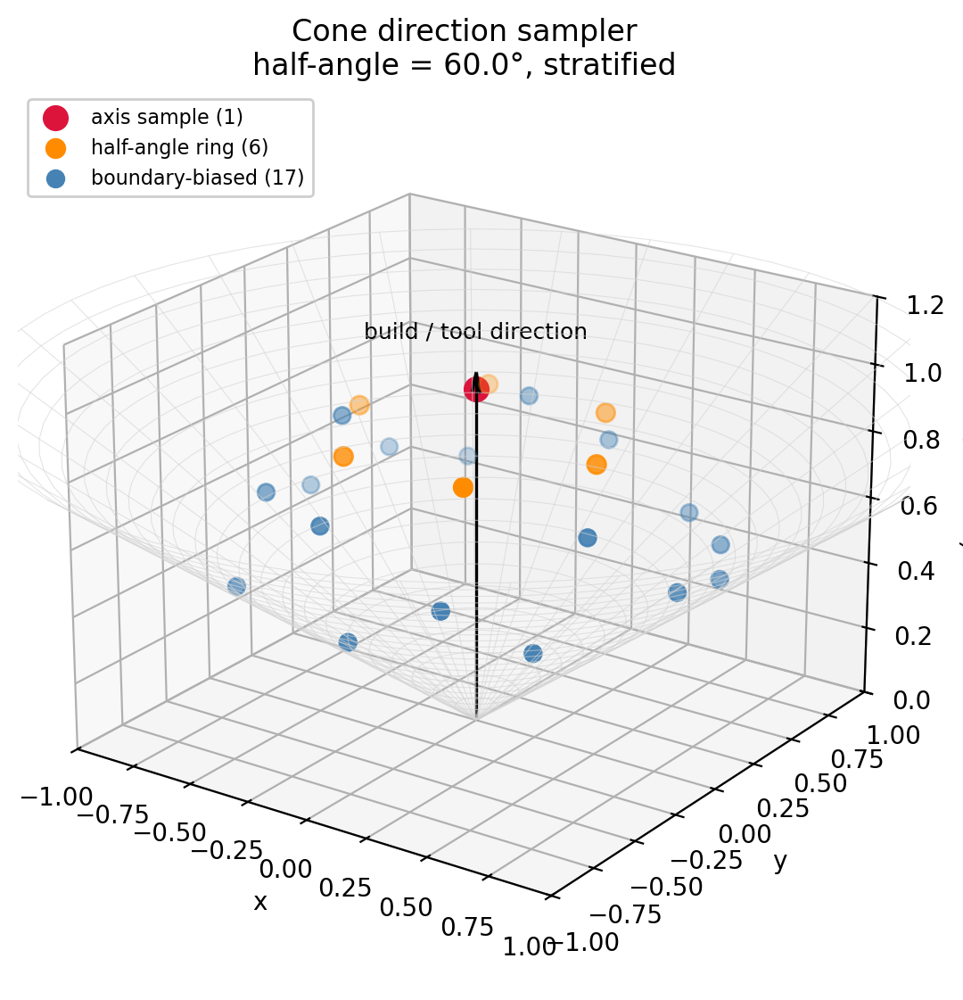
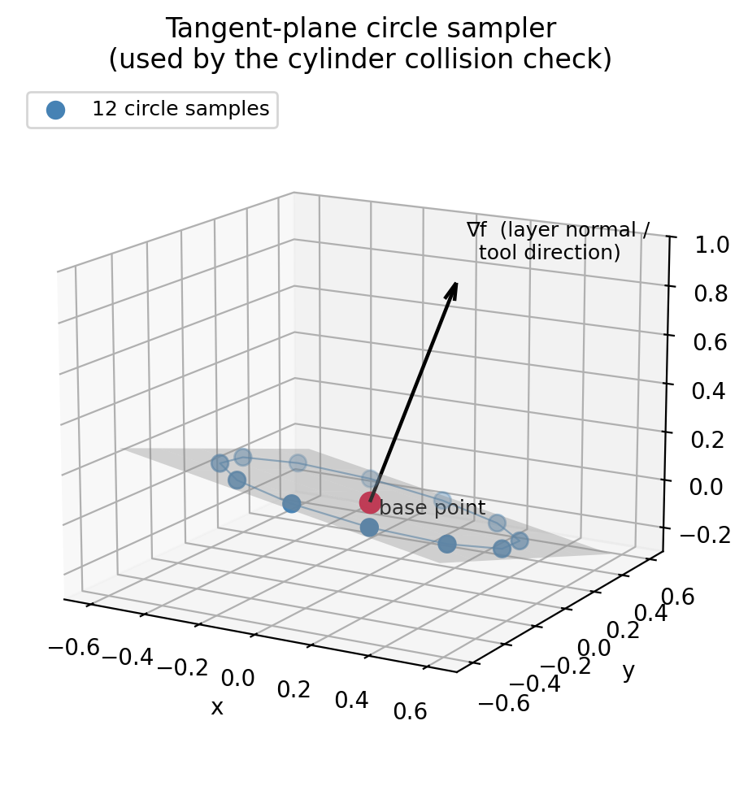
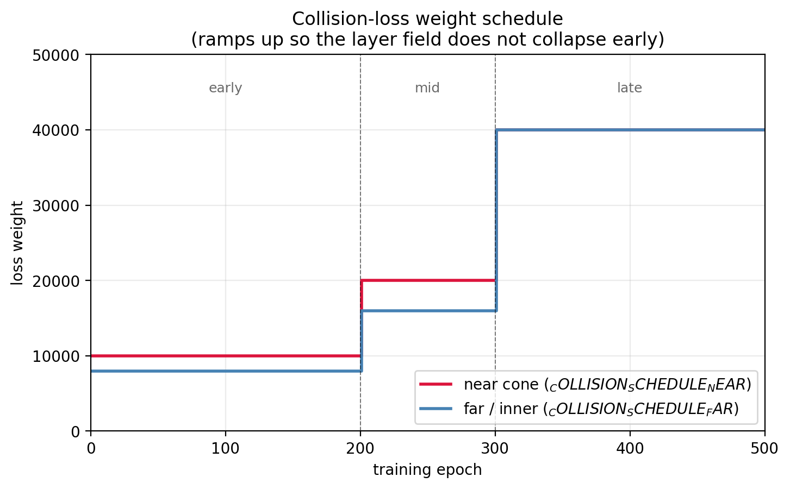

# Collision loss

The collision loss samples a **tool envelope** around the local build
direction and asks the scalar field to respect the ordering "stuff above
the base point should print *later* than the base point." If a sample
inside the envelope reads a layer value smaller than the base, that
implies the layer surface would re-enter material already printed —
i.e., a collision.

## Three sampling zones

`CollisionLoss` probes the same base point three ways:

1. **Near cone** — points inside a small forward cone around $\nabla f$,
   at along-axis distances `dist_vals`. Catches near-tool collisions
   and self-intersection.
2. **Far cylinder** (`collision_scalar_loss_far`) — points on a circle
   in the tangent plane, swept along $\nabla f$ at distances
   `dist_array_far`. Catches collisions with the bulk of the tool, not
   just the nozzle.
3. **Inner cylinder** (`collision_scalar_loss_far_in`) — same as the
   far cylinder but tighter radius, for the spindle / collet region.

{ width=80% }

## Cone direction sampler

The near-cone term samples directions inside a cone of half-angle
`config.collision_angle_degrees` (default 61°). The sampler is
deterministic in phi, biased toward the cone *boundary* in alpha:

{ width=80% }

- One sample exactly on the axis (the build direction itself).
- $m/4$ stratified at the half-angle ring (alpha = θ/2, uniform phi).
- The remaining samples near the cone boundary, weighted by $\cos^5$
  toward the rim.

The bias toward the rim catches **glancing** collisions that the axis
sample would miss — a sample exactly along $\nabla f$ might lie in
clear material while a sample at the cone boundary already pierces the
next layer.

!!! warning "The `(1 - 1) * rand(...)` bug"
    The original code wrote
    `cos_alpha_remaining = cos(theta) + (1 - 1) * rand(...) ** 5`
    which collapses every sample in the third group to exactly
    `cos(theta)` — a degenerate 2- or 3-latitude rosette instead of a
    cone. Fixed; see `tests/test_correctness.py::test_cone_sampler_is_non_degenerate`.

## Tangent-circle sampler

The far / inner cylinder terms sample points on a circle in the
tangent plane at the base point, then sweep that circle along
$\nabla f$:

{ width=80% }

The optional `randomize_phase=True` jitters the circle's starting
angle so consecutive batches don't always test the same spokes. The
`_far2` variant uses this; `_far` does not.

## Tool profile

The radii and along-axis distances are encoded in a `ToolProfile`
dataclass. Six presets ship:

| Name | Description |
|---|---|
| `standard` | Coarse 3-sample-per-tier baseline. |
| `dense` | Stricter clearance with 10-12 samples per cylinder. |
| `dense_uniform1` | Tuned for fertility / clip experiments. **Used by the shipped configs.** |
| `dense_uniform2` | Alternative dense profile with farther samples. |
| `dense1` | Sparse experimental profile, widely-spaced. |
| `dense2` | Sparse profile biased toward longer checks. |

Use `init_tool("dense_uniform1", scale=mesh_scale)` to configure
`CollisionLoss`. Tests in `tests/test_correctness.py` verify every
profile loads end-to-end on CPU and that unknown names raise `KeyError`
(no silent default).

## Schedule

The collision loss weight ramps up over training to avoid the layer
field collapsing under the constraint early:

{ width=85% }

| Epoch range | Near weight | Far weight |
|---|---|---|
| 0 – 200 | 1e4 | 8e3 |
| 200 – 300 | 2e4 | 1.6e4 |
| 300 + | 4e4 | 4e4 |

Defined in `field_losses._COLLISION_SCHEDULE_NEAR` and `_FAR`.

## NaN handling

If a collision sub-term goes non-finite, `_accumulate_collision_term`
prints a single-line warning identifying which sub-term blew up at
which epoch and zeros both the loss contribution and the logged
record. The original code silently zeroed the loss but polluted the
log with `NaN`, producing monotonically-NaN log files with no warning.
