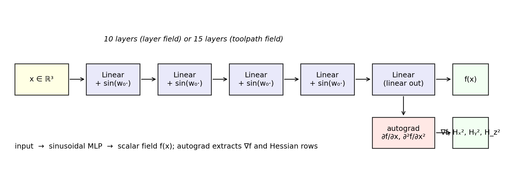

# Implicit fields

A scalar field $f: \mathbb{R}^3 \to \mathbb{R}$ partitions space by its
level sets $\{x \mid f(x) = c\}$. The pipeline trains two such fields with
non-overlapping geometric roles.

## Layer field

The layer field's level sets are the **manufacturing layers** — the slices
deposited (or carved away) in order. If $f_1(x) = c$ defines the surface a
nozzle traces on print pass $c$, then $\nabla f_1$ at every point on that
surface is the local **layer normal**, which the pipeline treats as the
**build direction** for collision and support-angle checks.

{ width=85% }

The figure shows a 2D slice. Solid lines are level sets of $f_1$; arrows
are the unit gradient $\nabla f_1 / \|\nabla f_1\|$. In 3D the level sets
are surfaces and the gradient picks the build direction at every point.

!!! tip "Why SIREN?"
    Sinusoidal activations make $f$ smooth and twice-differentiable
    everywhere, which is what lets the curvature losses use closed-form
    expressions of $H_f$ instead of finite differences. The `siren_pytorch`
    fork in this repo adds explicit Hessian row outputs (`HX2`, `HY2`,
    `HZ2`) precisely to enable these losses.

{ width=100% }

## Toolpath field

The toolpath field $f_2: \mathbb{R}^3 \to \mathbb{R}$ is sampled on the
*same* spatial points as $f_1$, but its level sets are restricted to lie
**inside** each layer. The intersection of a $f_1$-level-set with a
$f_2$-level-set is a curve — a toolpath. The pipeline enforces this by
projecting $\nabla f_2$ onto the tangent plane of $f_1$ and asking the
projected gradient to be a unit vector (uniform toolpath spacing in the
layer's metric):

$$
\nabla_{\!\perp} f_2 \;=\; \nabla f_2 - (\nabla f_2 \cdot \hat n_1)\,\hat n_1,
\quad \hat n_1 = \frac{\nabla f_1}{\|\nabla f_1\|}.
$$

The loss minimises $\big(\|\nabla_{\!\perp} f_2\| - 1\big)^2$. See
[Toolpath loss](toolpath-loss.md) for the curvature term that complements it.

## Gradient as direction

Both losses treat $\nabla f$ as a direction rather than a scalar
derivative. Three places this matters:

1. **Collision check** — samples are placed inside a cone around
   $\nabla f$, then the scalar values at those samples are checked
   against the value at the base point (see
   [Collision loss](collision-loss.md)).
2. **Support angle** — the angle between the outward surface normal and
   the negative build direction is bounded; the build direction *is*
   $\nabla f$.
3. **Toolpath tangency** — toolpaths are tangent to the layer iff
   $\nabla f_2 \cdot \nabla f_1 = 0$ in the projected sense above.

A consequence: $\|\nabla f\|$ should be **non-zero and smoothly varying**
across the domain. Two layer-loss terms enforce this; see
[Layer loss](layer-loss.md).
