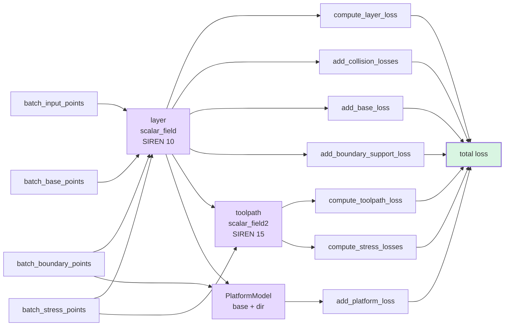
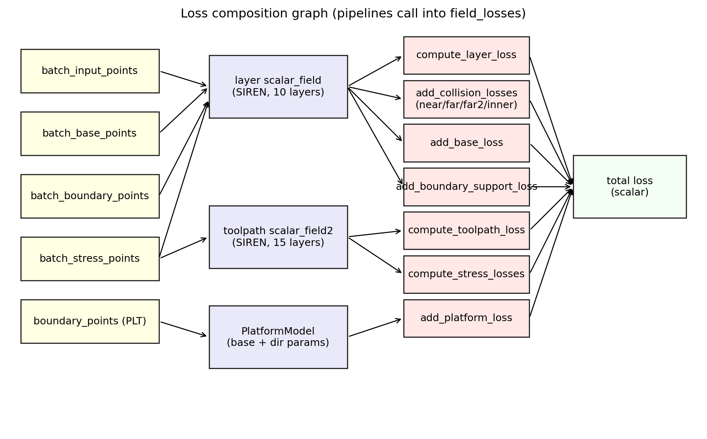

# The algorithm

The pipeline learns two scalar fields jointly with a platform pose model.
Every constraint — collision avoidance, support angle, layer curvature,
toolpath spacing, stress alignment — becomes a differentiable loss term.
The total loss is the sum of these terms, weighted on the schedule set in
`CommonTrainingConfig`.

## Loss composition

Same graph as a static figure (the mermaid above is for browsing, the PNG
below is what lands in the paper companion):

{ width=100% }

## Reading order

1. **[Implicit fields](fields.md)** — what the SIREN fields represent
   geometrically; gradient as tool direction; layers as level sets.
2. **[Layer loss](layer-loss.md)** — gradient-norm penalty, principal-curvature
   limit, why both are needed for a manufacturable layer field.
3. **[Collision loss](collision-loss.md)** — the cone + cylinder + cylinder
   tool envelope, sampled at every point per batch.
4. **[Toolpath loss](toolpath-loss.md)** — projecting the toolpath field's
   gradient onto each layer's tangent plane; geodesic-curvature cap.
5. **[Platform loss](platform-loss.md)** — the build platform as a learnable
   half-space; direction error + clearance check.

## Notation

| Symbol | Meaning |
|---|---|
| $f_1, f_2$ | layer field and toolpath field |
| $\nabla f$ | spatial gradient at a point; treated as local build / tool direction |
| $H_f$ | $3 \times 3$ Hessian of $f$ |
| $K_g, K_m$ | Gaussian and mean curvature of the level set |
| $k_g$ | geodesic curvature of a toolpath in the layer |
| $\theta_s$ | support-angle threshold (default 132°) |
| $R$ | mesh scale (the `range_vals[0]` from `experiment_loaders`) |

All formulas use the **outward-pointing gradient** convention. A sphere's
mean curvature comes out as $-1/R$, not $+1/R$, under this sign. The
implementation is consistent throughout; see
`tests/test_geometry.py` for analytical ground-truth checks.

!!! info "Conventions for implicit-surface curvature"
    The formulas in `shared_geometry` follow [Goldman, 2005, "Curvature
    formulas for implicit curves and surfaces"]. Closed-form expressions
    for $K_g, K_m$ in terms of $\nabla f$ and $H_f$ replace the autograd-
    differentiation-of-tangent approach used in older neural-implicit
    work — closed-form is faster and avoids the extra autograd graph.
