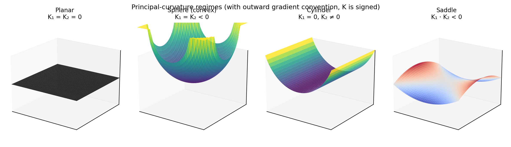

# Layer loss

The layer loss has two terms, both enforcing **manufacturability** of
the level-set surfaces.

## Gradient-norm smoothness

The first term penalises *spatial variation* of $\|\nabla f\|$. If
$\|\nabla f\|$ jumps suddenly across the domain, neighbouring layers will
have wildly different spacing — printable in toy 2D but rarely in 3D
multi-axis.

$$
\mathcal{L}_{\text{grad}}
= \mathbb{E}\!\left[\frac{\|\nabla \|\nabla f\| \|^2}{\|\nabla f\|+\varepsilon}\right]
+ \mathbb{E}\!\left[\exp(-k\,\|\nabla f\|^2)\right]
$$

The first term is the "gradient-of-the-gradient-norm" — second-order
autograd through the SIREN, finite because $f$ is twice-differentiable
everywhere. The second term is a one-sided penalty against
**near-zero gradients**, which make level-set extraction unstable. The
constant $k$ controls the sharpness:

- `field_losses._SMALL_GRAD_PENALTY_SHARPNESS = 100.0` — the penalty bites
  hard at $\|\nabla f\| < 0.1$ and is effectively zero by $\|\nabla f\| > 0.3$.

!!! note "Why `+ DENOM_FLOOR` everywhere"
    The expression $\|\nabla \|\nabla f\| \|^2 / \|\nabla f\|$ would
    explode at points where $\|\nabla f\| \to 0$. The `+ DENOM_FLOOR`
    (`1e-10`) guards against it. See `constants.py` for the single
    source of truth on this value.

## Curvature limit

The second term caps the **principal curvatures** of every layer
surface. Layers with curvature radius smaller than the tool footprint
cannot be machined or printed cleanly.

For an implicit surface, $K_g$ (Gaussian) and $K_m$ (mean) are computed
in closed form from $\nabla f$ and the Hessian rows (`HX2, HY2, HZ2`):

$$
K_g = \frac{
  f_x^2 (f_{yy} f_{zz} - f_{yz}^2)
  + f_y^2 (f_{xx} f_{zz} - f_{xz}^2)
  + f_z^2 (f_{xx} f_{yy} - f_{xy}^2)
  + 2\,\text{cross}
}{\|\nabla f\|^4}
$$

$$
K_m = \frac{\nabla f^\top H_f \nabla f - \|\nabla f\|^2 \operatorname{tr}(H_f)}
            {2 \|\nabla f\|^3}
$$

Then the principal curvatures are $K_m \pm \sqrt{K_m^2 - K_g}$. The
discriminant is non-negative in exact arithmetic; in float32 we add a
cascading-epsilon floor `(1e-7 → 2e-6 → 1e-5)` and emit a `RuntimeWarning`
each time we widen.

{ width=100% }

The loss caps the per-point principal curvature at
`config.curvature_limit / R` where $R$ is the mesh scale:

$$
\mathcal{L}_{\text{curv}} = \mathbb{E}\!\left[
  \operatorname{ReLU}\!\big(|K_i/R| - \tau\big)^2
\right], \quad i \in \{1, 2\}
$$

with the scaled-by-30 ReLU producing a quadratic hinge.

## Test ground truth

`tests/test_geometry.py` verifies the curvature formulas against:

- **Sphere** of varying radius — $K_g = 1/R^2$, $K_m = -1/R$.
- **Cylinder** — $K_g = 0$, $K_m = -1/(2R)$, principal $(0, -1/R)$.
- **Torus** at the outer equator — $K_g = 1/(r(R{+}r))$, principal $(-1/r,
  -1/(R{+}r))$.
- **Scale invariance** — sampling different points on the unit sphere
  must give the same curvature.
- **Small-scale stability** — sphere with $R = 0.01$ does not lose
  precision through the `DENOM_FLOOR` guard.

See the [API reference](../api/shared_geometry.md) for the full type
signatures.
