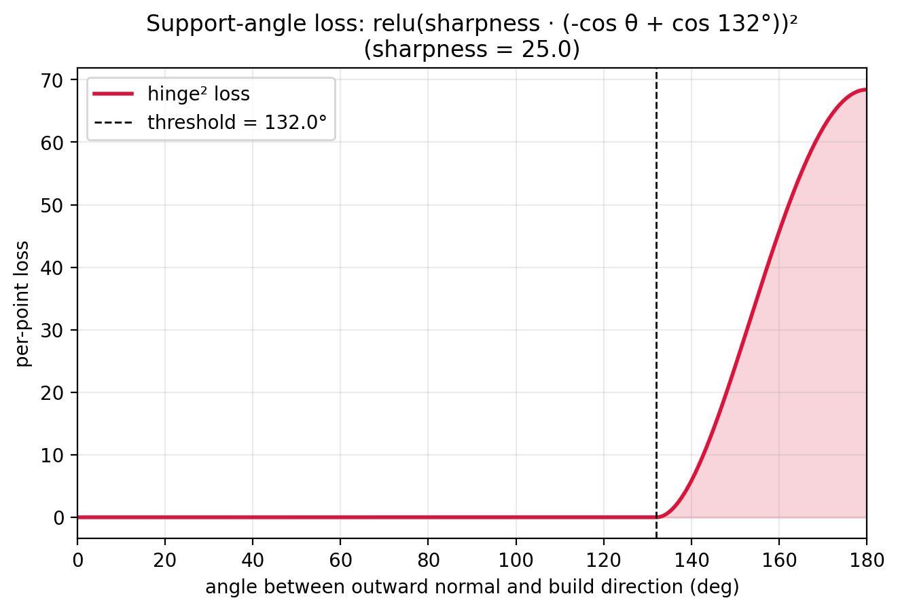

# Platform loss

The build platform is modelled as a **learnable half-space** — a base
point and an outward normal direction, both `nn.Parameter` so they
are co-optimised with the scalar fields.

## Support-angle prior

The platform loss is only enabled after `config.platform_start_epoch`
(default 1900) so the layer field has time to converge before the
platform begins constraining where its base points lie.

When enabled, the model first identifies the **boundary points that
need platform support** — those whose layer-gradient direction makes a
larger angle with the surface normal than `_PLATFORM_SUPPORT_ANGLE_DEG`
(137°, slightly higher than the layer support angle of 132°):

{ width=85% }

The same hinge shape that defines the support-free loss for layers
is used here to decide *which* boundary points the platform must catch.

## Four loss components

For the selected points and the current `(platform_base, platform_dir)`
state, the loss sums four terms:

1. **Direction**: the platform's outward normal should match the local
   layer-gradient direction at supported points.
2. **Above-plane**: every part of the part must sit above the platform
   plane (signed distance ≥ `disp_dist`).
3. **Outer clearance**: along a 60-unit ring above each support point,
   no sampled point may sit *inside* the clearance band.
4. **Inner clearance**: same idea, tighter ring at 30 units. Catches
   collisions with the platform mount / spindle that the outer ring
   would miss.

The four terms combine with the published weights:

$$
\mathcal{L}_{\text{platform}} =
  \mathcal{L}_{\text{dir}}
  + 0.1\,\mathcal{L}_{\text{dist}}
  + 0.05\,\mathcal{L}_{\text{outer}}
  + 0.05\,\mathcal{L}_{\text{inner}}
$$

Constants `_W_DISP2 / _W_CLEAR_OUTER / _W_CLEAR_INNER` in
`platform_losses.py`. The 1.0-direction-weight dominates: the platform
*orients first*, then settles its position.

!!! note "Why the platform model is `nn.Module`"
    `platform_base` and `platform_dir` are `nn.Parameter` so the
    third optimiser in `toolpath_alignment_pipeline.py` can update
    them with Adam. The model has no real "forward" — call
    `get_platform_pos_loss(...)` directly. A simple `nn.Module`
    subclass was chosen over a custom optimisable container because
    `model.state_dict()` then naturally handles checkpointing.
