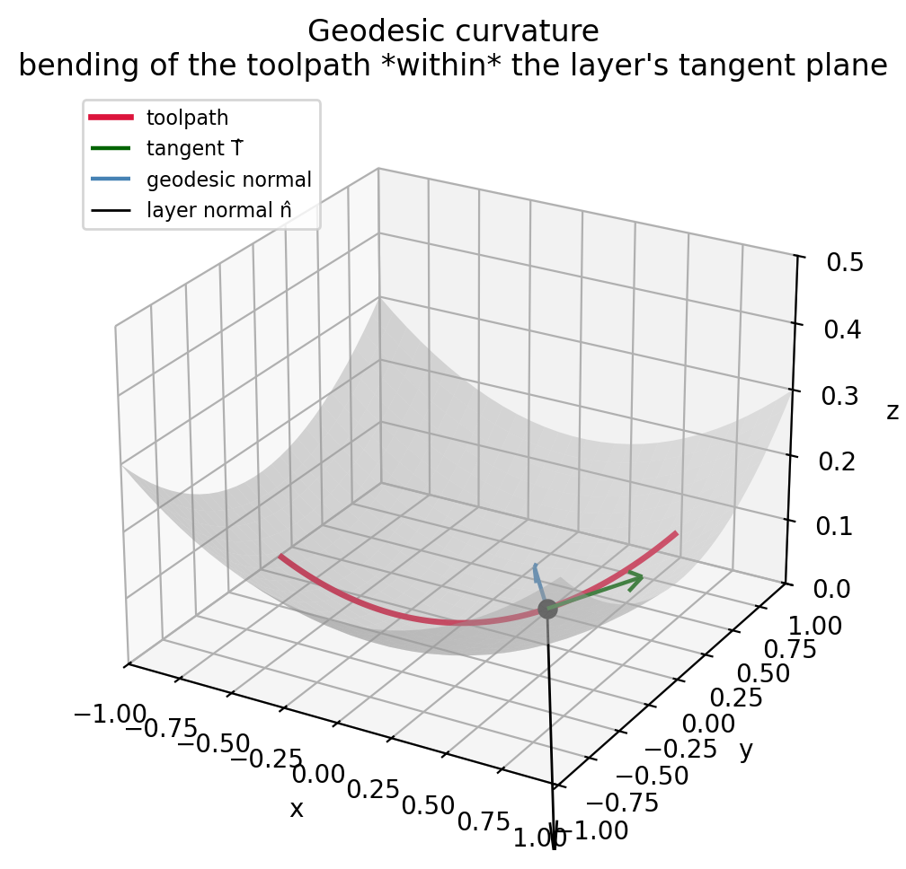

# Toolpath loss

Toolpaths are curves *inside* each layer. The toolpath field $f_2$'s
level sets are restricted to lie tangent to the layer field $f_1$'s
level sets, and to have **bounded geodesic curvature** so the tool can
follow them.

## Tangency + uniform spacing

The toolpath gradient projected onto the layer's tangent plane should
have unit norm. This enforces two things in one term:

- **Tangency**: $\nabla f_2 \cdot \nabla f_1 = 0$ when projected away
  from the layer normal.
- **Uniform spacing**: $\|\nabla_{\!\perp} f_2\| = 1$ implies consecutive
  toolpath level sets are unit-distance apart in the layer's metric.

$$
\mathcal{L}_{\text{tp,grad}}
= \mathbb{E}\!\left[\big(\|\nabla_{\!\perp} f_2\| - 1\big)^2\right]
$$

The weight on this term doubles every
`config.toolpath_gradient_norm_weight_update_every` epochs (default 40)
until it reaches `toolpath_gradient_norm_weight_max`.

## Geodesic curvature

Geodesic curvature of a toolpath in the layer surface measures how
sharply the toolpath bends *within* the layer (ignoring layer-normal
curvature). Bounded geodesic curvature ⇒ tool steerability.

{ width=85% }

The closed-form geodesic curvature `compute_geodesic_curvature2` takes
both gradients and both Hessian-row sets:

$$
\vec{T} = \frac{\nabla f_1 \times \nabla f_2}{\|\nabla f_1 \times \nabla f_2\|}
$$

$$
\dot{\vec{T}} = \text{derivative of}\;\vec{T}\;\text{using the Hessian rows
of}\;f_1, f_2
$$

$$
k_g = \big\| \dot{\vec{T}} - (\dot{\vec{T}} \cdot \hat n_1)\, \hat n_1 \big\|
$$

The loss caps $|k_g|/R$ at `_TOOLPATH_CURVATURE_LIMIT = 1/5`:

$$
\mathcal{L}_{\text{tp,curv}}
= \mathbb{E}\!\left[
  \text{ReLU}\!\big(10\,|k_g|/R - 10/5\big)^2
\right]
$$

## Gating

The curvature term is only meaningful when the projected gradient norm
$\|\nabla_{\!\perp} f_2\|$ is already close to its target. Early in
training the projected norm can be far from 1, making any "curvature"
computed on it dominated by gradient direction noise.

A sigmoid gate suppresses the curvature loss when the projected norm
is small:

$$
g(\|\nabla_{\!\perp} f_2\|)
= \sigma\!\left(200 \cdot (\|\nabla_{\!\perp} f_2\| - 0.3)\right)
$$

This effectively switches the curvature loss on around
`_PROJECTION_NORM_THRESHOLD = 0.3`. The 200x sharpness makes the
transition nearly a step function.

!!! info "Why a soft gate?"
    A hard `if projected_norm > 0.3` would not propagate gradients
    through the projection-norm itself. The sigmoid gate gives a
    differentiable, vanishingly-small contribution outside the gate
    and full strength inside.
