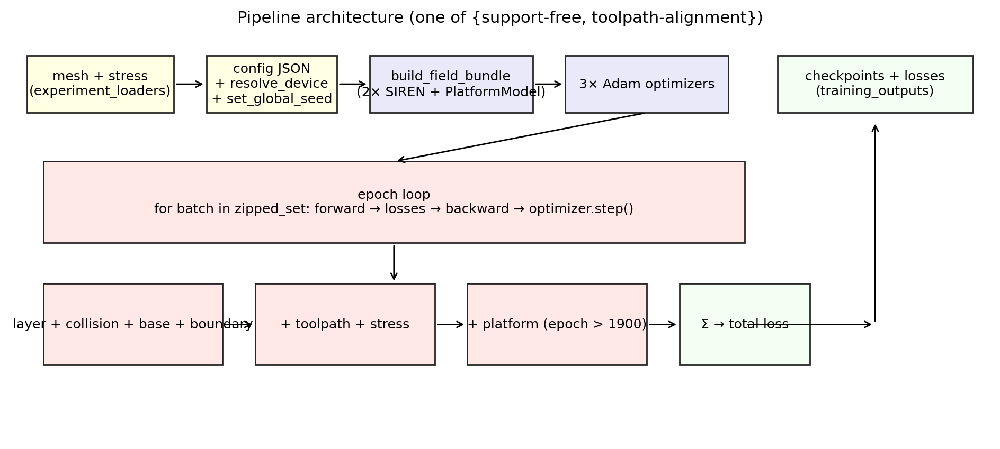
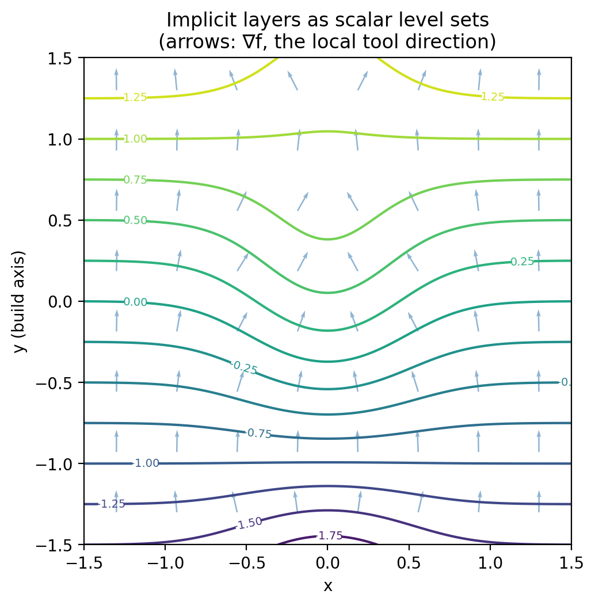

# Implicit Multi-Axis

Code companion to **Implicit Neural Field-Based Process Planning for Multi-Axis
Manufacturing** (Dutta, Zhang, Liu, Chen, Wang — *Computer-Aided Design*,
accepted May 2026). [Project page](https://neelotpal-d.github.io/Implicit_MultiAxis/).

## Pipeline at a glance

{ width=100% }

## The idea in one figure

The pipeline trains a pair of [SIREN] neural fields. The **layer field**'s
level sets become the manufacturing layers; the **toolpath field**'s level
sets become the toolpaths inside each layer. Both fields are differentiable
everywhere, so collision avoidance, support-angle constraints, and
stress-aligned toolpaths all become *loss terms* trained jointly.

{ width=80% }

The arrows show ∇f at sparse points — that gradient is treated as the local
build/tool direction at every step of the algorithm.

[SIREN]: https://arxiv.org/abs/2006.09661

## What's in this site

<div class="grid cards" markdown>

- :material-cube-outline: **[Algorithm](algorithm/index.md)**

    The math: implicit-surface curvature, the cone-envelope collision
    proxy, the geodesic-curvature toolpath loss, the platform half-space
    model. With conceptual diagrams.

- :material-play: **[Reproduce](reproduce.md)**

    Tiered recipe: render shipped checkpoints (~minutes), retrain the two
    shipped experiments (~hours on a GPU), or contact the authors for
    additional figures.

- :material-magnify: **[Code review](code-review.md)**

    The original ETH-prof-quality audit and its resolution status. Useful
    if you're considering using this code as a starting point.

- :material-api: **[API reference](api/index.md)**

    Autodoc for every module. `shared_geometry`, `field_losses`,
    `collisionLoss`, `platform_losses`, `sdfField`, `experiment_loaders`,
    `repro`, `constants`, `training_dataclasses`.

</div>

## Quick start

```bash
pixi install
pixi run smoke          # validates env on the resolved device
pixi run reproduce-paper
```

See [Reproduce](reproduce.md) for what the smoke test verifies and how
the device is resolved (`auto` picks cuda > mps > cpu).

## Verified platforms

| Platform | Status | Notes |
|---|---|---|
| Linux + CUDA | ✅ | Original target |
| macOS arm64 (M1/M2/M3/M4) + MPS | ✅ | Verified by `tests/test_smoke.py::test_shipped_fertility_checkpoint_loads_on_resolved_device` |
| Linux + CPU | ✅ | Slow but functional |
| macOS x86 | ❌ | Newer torch wheels do not ship for `osx-64` |

## Citation

```bibtex
@article{dutta2026implicit,
  title   = {Implicit Neural Field-Based Process Planning for Multi-Axis Manufacturing},
  author  = {Dutta, Neelotpal and Zhang, Tianyu and Liu, Tao and Chen, Yongxue and Wang, Charlie C.L.},
  journal = {Computer-Aided Design},
  year    = {2026}
}
```

A `CITATION.cff` is provided for the GitHub auto-citation widget.

## License

MIT, including the vendored modified copy of
[lucidrains/siren-pytorch](https://github.com/lucidrains/siren-pytorch).
